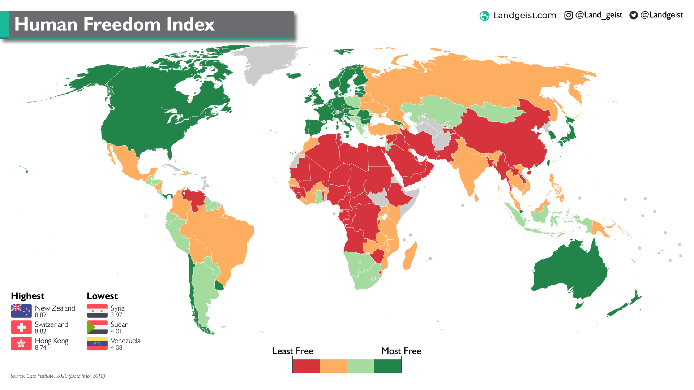

# Introduction to the Human Freedom Index

## INFO 201 "Foundational Skills for Data Science" — Spring 2022

Authors: Vy Nguyen

Aldo Meneses-Campos

Mustafa Abdulkadir

Camden Yu

Olivia Moffett

Link: https://mustafabd.shinyapps.io/final-project-memo-rexx/

Please create the necessary files for your multi-page Shiny app in this GitHub repository. Consult the Canvas assignment for more details. Be sure to publish your app on Shinyapps.io.

When you are finished, please add the text from your introductory and concluding pages below. You might want to use this GitHub repository as part of your digital portfolio, so you want this README.md to offer a brief description of the project and key takeaways.

Feel free to delete these instructions for your final README.md file and to make your GitHub repository public if you would like others to be able to see it. 

# Introduction to the Human Freedom Index
This is the analysis of the Human Freedom Index from the Cato Institute’s research from 2008 to 2019.

[Kaggle - The Human Freedom Index](https://www.kaggle.com/datasets/gsutters/the-human-freedom-index?select=hfi_cc_2021.csv)

Our project is centralized around observation of the world’s countries and what insights we can take from the Human Freedom Index. With this data, we are able to understand how oppressive the governments of certain nations are and how expressive the citizens are allowed to be.

Some of the limitations of the dataset on Kaggle are that specific indicators, such as daughters inheritance, are missing significant data. Furthermore, there is a category named Rule of Law which includes mostly crime statistics. To try to maintain the integrity of the dataset, we have removed these specific indicators.

2018 Freedom Score, from Land Geist, who appears to be using 

red = (0 - 5.75)    
orange = (5.75 - 7.15)      
lime = (7.15 - 8.2)    
green = (8.2 - 10)

## Our 3 research questions

Over the decade since data has been collected, how have the world’s countries’ scores shifted and does this tell us anything about shifts in certain regions of the world?

How might the ranking of countries show the progress of the lowest and highest rated countries and does this reflect a greater shift in the world’s human freedom?

What does the freedom of expression ranking say about the countries of the world and how do these results demonstrate the culture of the region?

# Conclusion

After reviewing our dataset and the ways we explored the values, we summarized our findings into 3 identifying takeaways that centered our project: the way countries’ human freedom scores have shifted, how the highest and lowest ranked countries have progressed over time, and the influence of freedom of expression rankings from regions’ culture and various other factors. Looking at the main analysis of human freedom and the ways it differs by country, in our **first graph**, we can observe the variations in each countries’ scores, focusing on the shifts between the indexes across time. This allows us to gauge the levels of government involvement and the ways it may have changed as the countries continue to progress and develop, or even how it remains stagnant despite the progression of time. 

With our **second graph**, we observe the ways in which the lowest and highest ranked countries have progressed and change through time. In analyzing the disparities in the highest and lowest ranked countries, we notice the ways in which governed countries are the most and least oppressive, uncovering even unanticipated results that most would not have considered. Our findings help us better understand how human freedom index scores vary in each country and the complications they possess. 

The country we’ve observed with the highest human freedom score of 9.14/10 is Switzerland.
In comparison, the country with the lowest score of 3.83/10 is the Syrian Arab Republic. Below we can analyze how these countries compare. 

In our **third graph**, we can observe trends of the freedom of expression rankings that differ from factors such as culture and other social influences of the regions. In observing the movement of freedom of expression rankings, we can compare the potential impacts of culture and religion in the extent of expression with each region. With this, we gain insight on the limitations in expression upon the countries in which culture, religion, and social influences have been oppressed compared to the countries with higher freedom of expression scores.

Keeping our research in mind, we focused on understanding how the human freedom index impacts the countries that we analyzed. The variations in scores with common and unexpected countries ranking the highest and lowest allow us to view the ethics surrounding how countries compare to one another even in different freedom rankings. Throughout our project, we can see patterns and differences in the countries ranking highest in human freedom and freedom of expression. The insights have allowed us to view the shifts and progression in human freedom and more as oppression in various countries change through time, some places more than others. 

